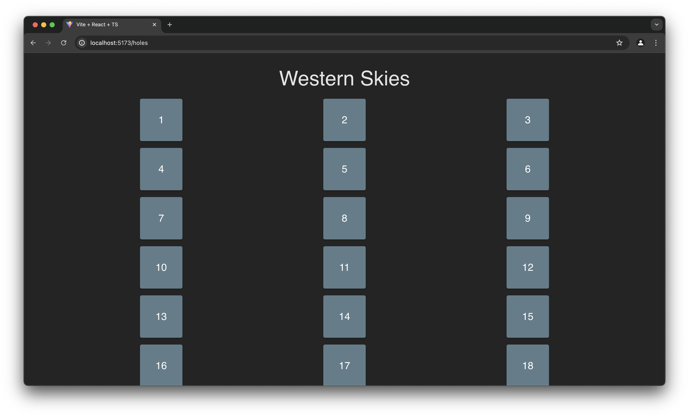
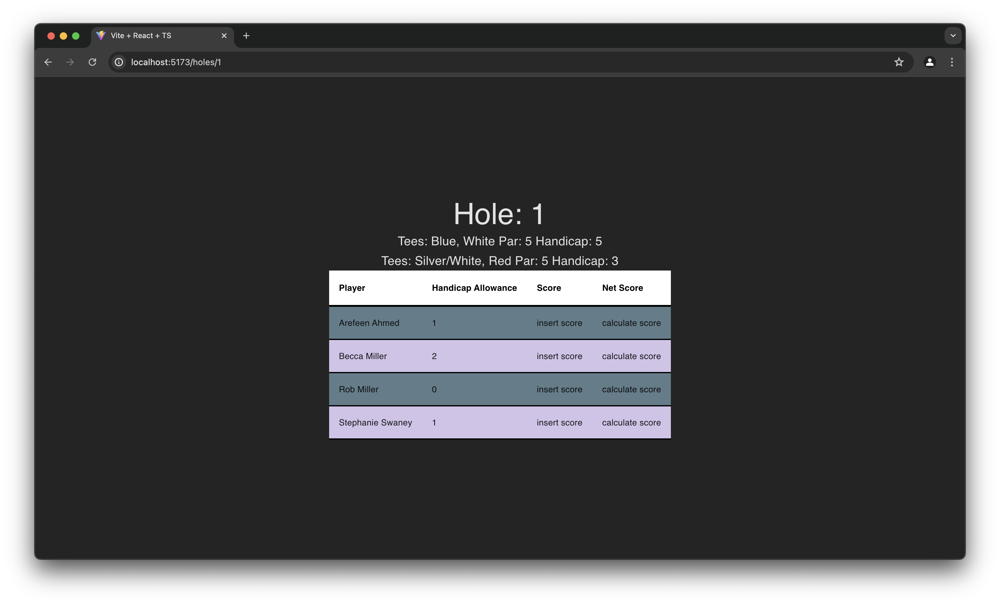

# React + TypeScript + Vite

Play golf games with friends and handicaps.

Created via `npm create vite@latest golf-vite -- --template react-ts`

Project still includes some css files from the starter - should be revisited later.

## Current App
Currently the app has hardcoded values for 4 players and 1 course. This is what the site currently looks like when running:

After clicking the "Begin" button, a list of holes will appear:

Clicking on a hole will show specific info for that hole. Later it allow user input for the score and will calculate net score.

