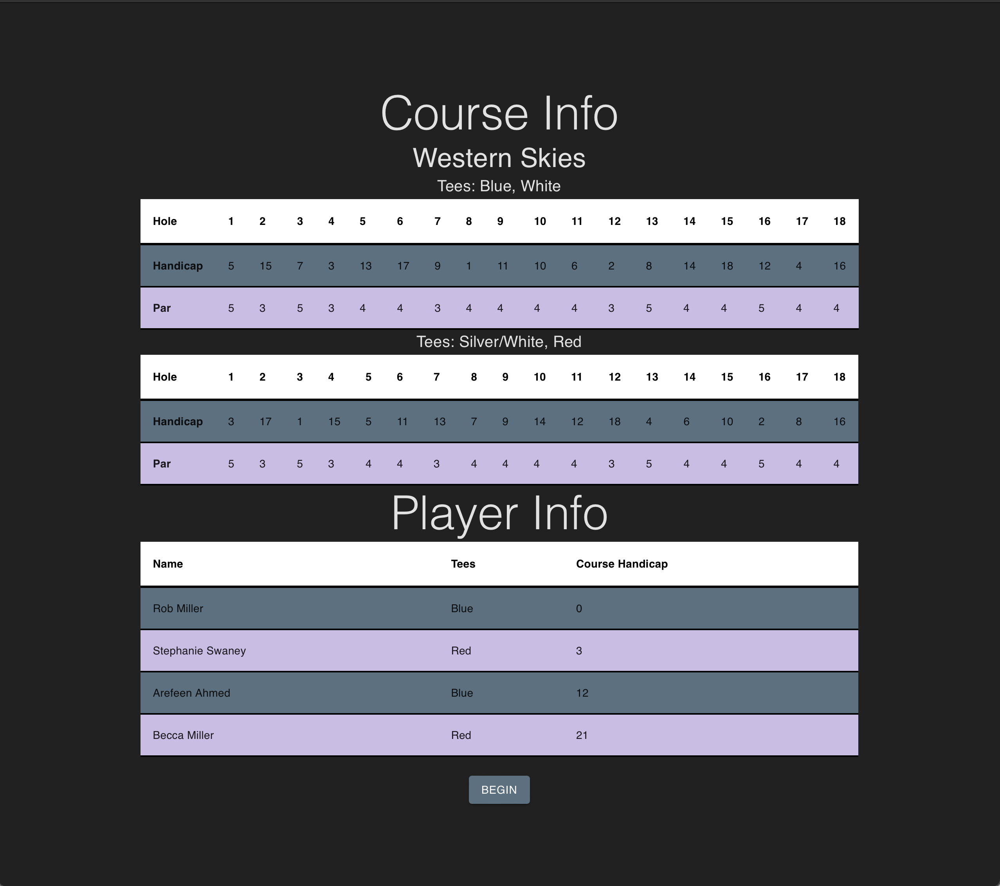
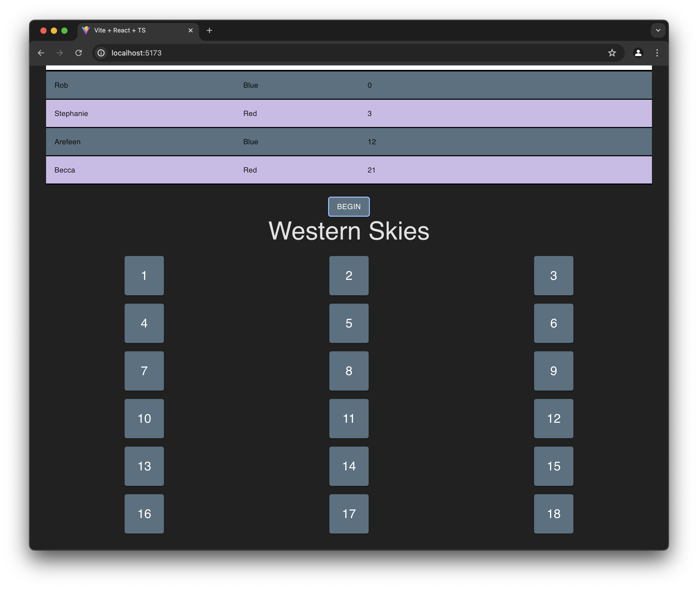
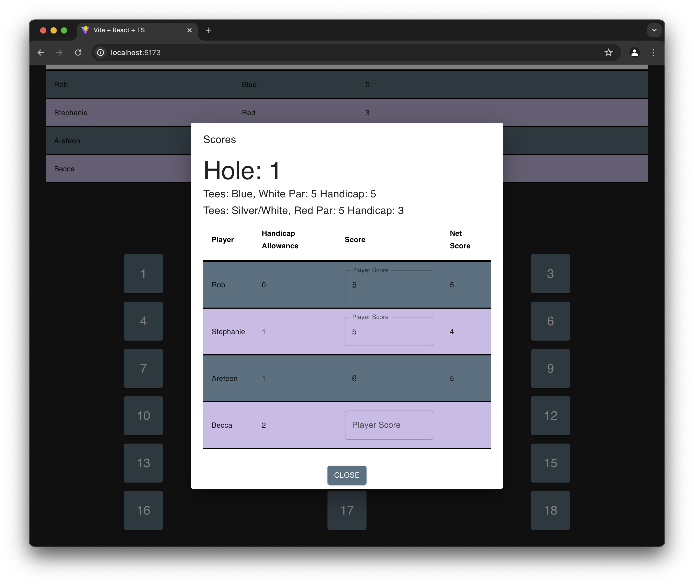

# React + TypeScript + Vite

Play golf games with friends and handicaps.

Created via `npm create vite@latest golf-vite -- --template react-ts`

Project still includes some css files from the starter - should be revisited later.

## Getting Started

Ensure you have the latest version of npm and node installed. Then, install dependencies:

`npm install`  

And run the app locally:

`npm run dev`

Alternatively, you can run directly using vite by doing:

`npm install -g vite`  
`vite`

## Deployment
https://golf-yc.web.app - Deployed via Firebase

## Current App
Currently the app has hardcoded values for 4 players and 1 course. This is what the site currently looks like when running:

After clicking the "Begin" button, a list of holes will appear:

Clicking on a hole will show specific info for that hole. It takes in user input & automatically calculates the net score for each player.

